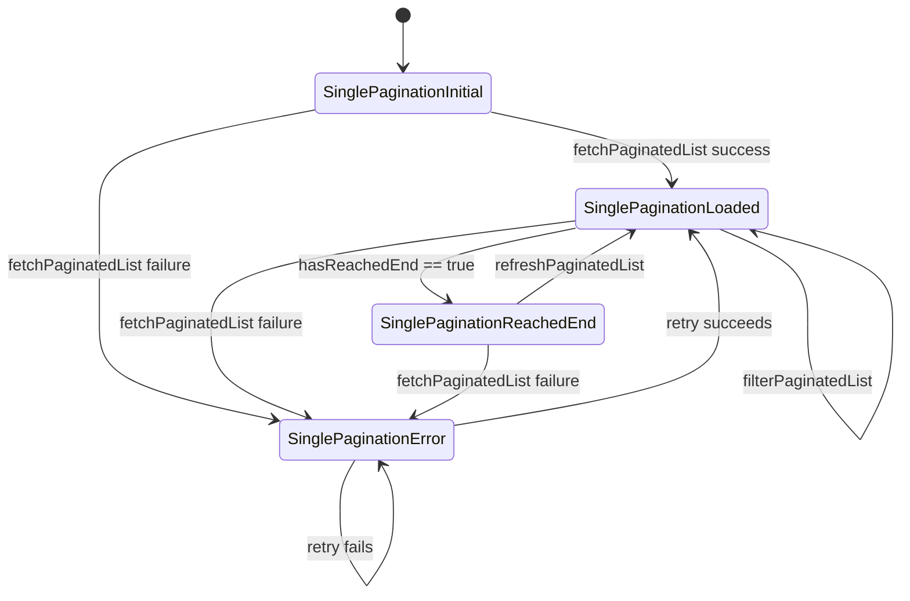

# Custom Pagination 📄

[](https://pub.dev/packages/custom_pagination)
[](LICENSE)
[](https://flutter.dev)

A comprehensive Flutter pagination library with BLoC pattern support. Provides flexible pagination for REST APIs with multiple view types and advanced features.

## ✨ Features

- **🎨 Multiple Layout Support**: ListView, GridView, PageView, StaggeredGridView, Column, Row
- **🏗️ BLoC Pattern**: Clean state management using flutter_bloc
- **🔄 Dual Pagination Strategies**: Cursor-based and Offset-based pagination
- **📊 Grouped Pagination**: Organize items by keys (e.g., messages by date, products by category)
- **🔁 Retry Mechanism**: Automatic retry with exponential backoff for failed requests
- **📡 Stream Support**: Real-time updates via stream providers
- **💾 Memory Management**: Configurable page caching (maxPagesInMemory)
- **🔍 Filtering & Search**: Built-in filter listeners with type-safe callbacks
- **🔄 Pull-to-Refresh**: Easy refresh functionality
- **📍 Scroll Control**: Programmatic scrolling to items or indices
- **🎯 Type-Safe**: Full generic type support
- **⚡ Performance Optimized**: Efficient rendering and data loading
- **🛠️ Convenience Widgets**: Ready-to-use widgets for common pagination scenarios

## 📦 Installation

Add this to your package's `pubspec.yaml` file:

```yaml
dependencies:
  custom_pagination: ^0.0.4
```

Then run:

```bash
flutter pub get
```

## 🚀 Overview

`SinglePagination` is a lightweight, widget-driven pagination helper that works with any asynchronous data source. Instead of depending on repositories or HTTP clients, you provide a callback that returns `Future<List<T>>` and, optionally, a separate stream factory for live updates. The widget handles page state, loading/error UI, scroll-to-item helpers, and filtering hooks so you can focus on mapping your domain responses to `List<T>`.

> Works great with repository helpers or any REST API that exposes paginated lists.

## Quick Start

### Simple ListView Pagination

```dart
SinglePaginatedListView<Product>(
  request: PaginationRequest(page: 1, pageSize: 20),
  dataProvider: (request) => apiService.fetchProducts(request),
  childBuilder: (context, product, index) {
    return ListTile(
      title: Text(product.name),
      subtitle: Text('\$${product.price}'),
    );
  },
)
```

### GridView Pagination

```dart
SinglePaginatedGridView<Product>(
  request: PaginationRequest(page: 1, pageSize: 20),
  dataProvider: (request) => apiService.fetchProducts(request),
  gridDelegate: SliverGridDelegateWithFixedCrossAxisCount(
    crossAxisCount: 2,
    childAspectRatio: 0.75,
  ),
  childBuilder: (context, product, index) {
    return ProductCard(product: product);
  },
)
```

### Grouped Pagination (Messages by Date)

```dart
DualPaginatedListView<String, Message>(
  request: PaginationRequest(page: 1, pageSize: 50),
  dataProvider: (request) => apiService.fetchMessages(request),
  groupKeyGenerator: (message) {
    return DateFormat('yyyy-MM-dd').format(message.timestamp);
  },
  groupHeaderBuilder: (context, dateKey, messages) {
    return Container(
      padding: EdgeInsets.all(16),
      color: Colors.grey[200],
      child: Text(dateKey, style: TextStyle(fontWeight: FontWeight.bold)),
    );
  },
  childBuilder: (context, message, index) {
    return MessageTile(message: message);
  },
)
```

## Data Provider Contract

```dart
typedef PaginationDataProvider<T> = Future<List<T>> Function(PaginationRequest request);
typedef PaginationStreamProvider<T> = Stream<List<T>> Function(PaginationRequest request);
```

- The `PaginationRequest` carries the current page, `pageSize`, and optional filters.
- Returning fewer items than `pageSize` will automatically mark the end of the list.
- Provide `PaginationStreamProvider` when the backend exposes a watchable stream.

### PaginationRequest

```dart
const PaginationRequest(
  page: 1,
  pageSize: 20,
  filters: {'status': 'active'},
);
```

Fields are immutable; use `copyWith` when you need to adjust values.

### PaginationMeta

Every `SinglePaginationLoaded` state surfaces a `PaginationMeta` instance describing the last fetch (page, pageSize, hasNext, etc.).

## State Lifecycle



- **SinglePaginationInitial** - before the first fetch
- **SinglePaginationLoaded** - exposes `items`, `allItems`, and `meta`
- **SinglePaginationReachedEnd** - same as loaded with `hasReachedEnd == true`
- **SinglePaginationError** - wraps the thrown `Exception`

## Listeners & Helpers

- `SinglePaginationRefreshedChangeListener` - toggle `refreshed = true` to trigger a refresh
- `SinglePaginationFilterChangeListener<T>` - push a `WhereChecker<T>` to perform in-memory filtering
- `SinglePaginationOrderChangeListener<T>` - provide a `CompareBy<T>` sorter before rendering

Attach them through the `listeners` parameter; the widget wires them using `MultiProvider` automatically.

## Controller APIs

`SinglePaginationController` mirrors the cubit methods:

- `fetchPaginatedList({PaginationRequest? requestOverride, int? limit})`
- `refreshPaginatedList({PaginationRequest? requestOverride, int? limit})`
- `filterPaginatedList(WhereChecker<T>? predicate)`
- `insertEmit` / `addOrUpdateEmit`
- `scrollToItem` / `scrollToIndex`

## Tips

- Compare the returned list length with the requested `pageSize` to decide whether more data is available.
- For repository responses that include totals, use them to enrich `PaginationMeta` via the cubit's `copyWith` helpers if needed.
- Use `streamProvider` to bridge watch queries (e.g., local database streams) into the pagination flow.

## Testing

- **Cubit Tests** - mock the data provider and verify state transitions with `blocTest`
- **Widget Tests** - inject a fake provider that returns deterministic lists and assert loading/empty/content states

Example test:

```dart
blocTest<SinglePaginationCubit<MyModel>, SinglePaginationState<MyModel>>(
  'emits loaded state when data is fetched successfully',
  build: () => SinglePaginationCubit<MyModel>(
    request: PaginationRequest(page: 1, pageSize: 20),
    dataProvider: (request) async => [MyModel(id: '1', name: 'Test')],
  ),
  act: (cubit) => cubit.fetchPaginatedList(),
  expect: () => [
    isA<SinglePaginationLoaded<MyModel>>(),
  ],
);
```

## 🏗️ Architecture

The library follows clean architecture principles with clear separation:

```
lib/
├── core/                    # Core interfaces and mixins
│   ├── bloc/               # IPaginationCubit, IPaginationState, IPaginationListeners
│   ├── controller/         # IPaginationController interfaces
│   └── widget/             # Shared widgets (loaders, errors, empty states)
├── data/                   # Data models
│   └── models/             # PaginationRequest, PaginationMeta
└── single_pagination/      # Single pagination implementation
    ├── bloc/               # SinglePaginationCubit, State, Listeners
    ├── controller/         # SinglePaginationController with scroll capabilities
    └── widgets/            # PaginateApiView with multiple layout support
```

## 📚 Additional Examples

### Custom Empty and Loading States

```dart
SinglePagination<MyModel>(
  request: PaginationRequest(page: 1, pageSize: 20),
  dataProvider: fetchData,
  itemBuilder: (context, items, index) => ListTile(title: Text(items[index].name)),
  loadingWidget: Center(child: Text('Loading awesome content...')),
  emptyWidget: Center(child: Text('No items yet. Add some!')),
  bottomLoader: Padding(
    padding: EdgeInsets.all(8),
    child: CircularProgressIndicator(strokeWidth: 2),
  ),
)
```

### Custom Height for Empty/Loading

```dart
SinglePagination<MyModel>(
  request: PaginationRequest(page: 1, pageSize: 20),
  dataProvider: fetchData,
  itemBuilder: (context, items, index) => ListTile(title: Text(items[index].name)),
  heightOfInitialLoadingAndEmptyWidget: 300, // Custom height
)
```

### Horizontal Scrolling

```dart
SinglePagination.listView(
  cubit: cubit,
  scrollDirection: Axis.horizontal,
  itemBuilder: (context, items, index) {
    return Container(
      width: 150,
      child: Card(child: Center(child: Text(items[index].name))),
    );
  },
)
```

### Before Build Hook

Use `beforeBuild` to transform the state before rendering:

```dart
SinglePagination<MyModel>(
  request: PaginationRequest(page: 1, pageSize: 20),
  dataProvider: fetchData,
  itemBuilder: (context, items, index) => ListTile(title: Text(items[index].name)),
  beforeBuild: (state) {
    // Sort items before rendering
    final sorted = state.items..sort((a, b) => a.name.compareTo(b.name));
    return state.copyWith(items: sorted);
  },
)
```

## 🔧 Advanced Configuration

### List Builder

Transform items before they're emitted:

```dart
SinglePaginationCubit<MyModel>(
  request: PaginationRequest(page: 1, pageSize: 20),
  dataProvider: fetchData,
  listBuilder: (items) {
    // Remove duplicates, sort, or transform
    return items.toSet().toList()..sort((a, b) => a.id.compareTo(b.id));
  },
)
```

### Callbacks

```dart
SinglePaginationCubit<MyModel>(
  request: PaginationRequest(page: 1, pageSize: 20),
  dataProvider: fetchData,
  onInsertionCallback: (items) {
    print('Items inserted: ${items.length}');
  },
  onClear: () {
    print('List cleared');
  },
)
```

### Custom Logger

```dart
SinglePaginationCubit<MyModel>(
  request: PaginationRequest(page: 1, pageSize: 20),
  dataProvider: fetchData,
  logger: Logger(
    printer: PrettyPrinter(),
    level: Level.debug,
  ),
)
```

## 🎯 Best Practices

1. **Reuse Cubits**: Create cubits once and reuse them with `SinglePagination.cubit()`
2. **Memory Management**: Set `maxPagesInMemory` based on your item size and device constraints
3. **Error Handling**: Always provide custom `onError` for better UX
4. **Testing**: Mock data providers for predictable tests
5. **Performance**: Use `listBuilder` for heavy transformations rather than `beforeBuild`

## 🤝 Contributing

Contributions are welcome! Here's how you can help:

1. Fork the repository
2. Create your feature branch (`git checkout -b feature/amazing-feature`)
3. Commit your changes (`git commit -m 'Add some amazing feature'`)
4. Push to the branch (`git push origin feature/amazing-feature`)
5. Open a Pull Request

Please ensure:
- All tests pass
- Code is properly formatted (`flutter format .`)
- Documentation is updated
- Examples are provided for new features

## 📝 Changelog

See [CHANGELOG.md](CHANGELOG.md) for a detailed list of changes.

## 📄 License

This project is licensed under the MIT License - see the [LICENSE](LICENSE) file for details.

## 🙏 Acknowledgments

- Built with [flutter_bloc](https://pub.dev/packages/flutter_bloc) for state management
- Uses [scrollview_observer](https://pub.dev/packages/scrollview_observer) for advanced scroll control
- [flutter_staggered_grid_view](https://pub.dev/packages/flutter_staggered_grid_view) for staggered layouts
- Inspired by Flutter pagination best practices and community feedback

## 📧 Support

- 📫 Open an issue on [GitHub](https://github.com/GeniusSystems24/custom_pagination/issues)
- 💬 Start a discussion in [Discussions](https://github.com/GeniusSystems24/custom_pagination/discussions)
- ⭐ Star the repo if you find it useful!

## 🎨 Example App

The library includes a comprehensive example app demonstrating all features:

```bash
cd example
flutter pub get
flutter run
```

The example app includes:
- **Basic ListView**: Simple paginated product list
- **GridView**: Product grid with pagination
- **Retry Mechanism**: Demonstrates automatic retry on network errors
- **Filter & Search**: Real-time filtering and search with pagination
- **Grouped Messages**: Messages grouped by date using DualPagination

## 🔁 Retry Mechanism

The library includes a powerful retry mechanism with exponential backoff:

```dart
SinglePaginatedListView<Product>(
  request: PaginationRequest(page: 1, pageSize: 20),
  dataProvider: (request) => apiService.fetchProducts(request),
  retryConfig: RetryConfig(
    maxAttempts: 3,
    initialDelay: Duration(seconds: 1),
    maxDelay: Duration(seconds: 10),
    timeoutDuration: Duration(seconds: 30),
    shouldRetry: (error) {
      // Custom retry logic
      return error is NetworkException;
    },
  ),
  childBuilder: (context, product, index) {
    return ProductCard(product: product);
  },
)
```

Features:
- Automatic retry with exponential backoff
- Configurable max attempts and delays
- Timeout support
- Custom retry conditions
- Specialized exceptions (TimeoutException, NetworkException, etc.)

## 🗺️ Roadmap

- [x] Single Pagination implementation
- [x] Dual Pagination (grouped) implementation
- [x] Retry mechanism with exponential backoff
- [x] Comprehensive unit tests (60+ tests)
- [x] Convenience widgets (SinglePaginatedListView, etc.)
- [x] Example app with multiple demos
- [ ] Widget and integration tests
- [ ] Performance benchmarks
- [ ] Video tutorials
- [ ] CI/CD setup
- [ ] pub.dev publication

---

**The module is transport agnostic**: bring your own async function and enjoy consistent pagination UI.

Made with ❤️ by [Genius Systems 24](https://github.com/GeniusSystems24)
