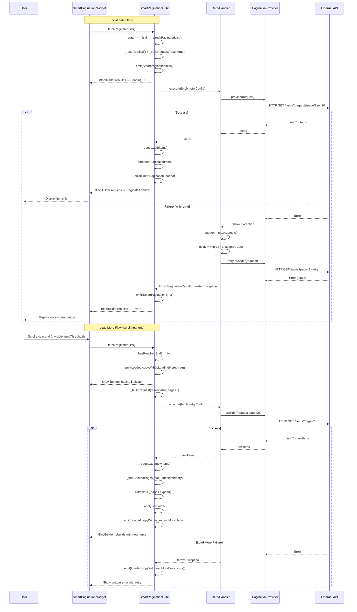
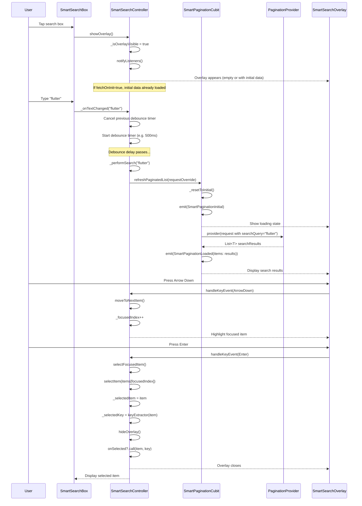
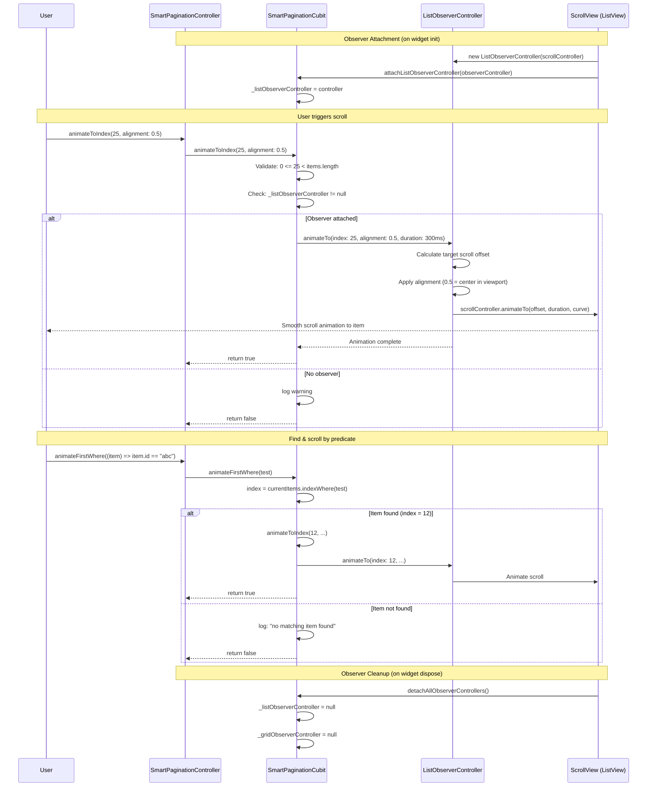
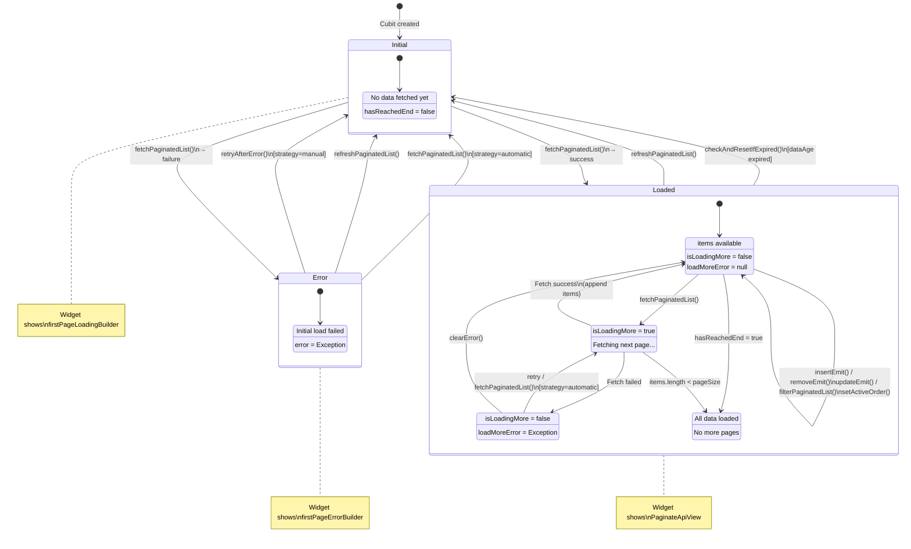
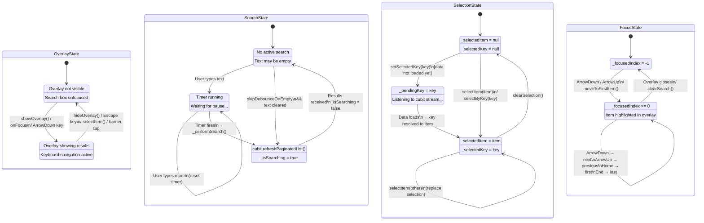
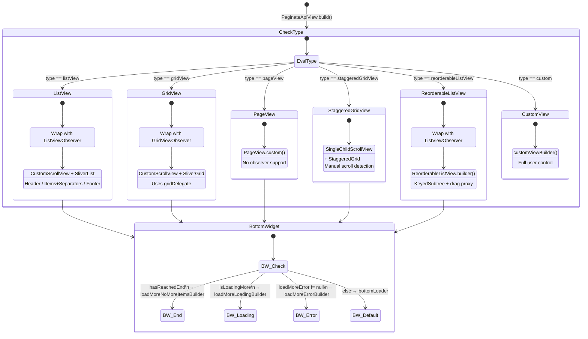

# Smart Pagination - Architecture Documentation

## 1. Architecture Diagram

```mermaid
graph TB
    subgraph Presentation["Presentation Layer"]
        SP["SmartPagination&lt;T&gt;"]
        PAV["PaginateApiView&lt;T&gt;"]
        SSD["SmartSearchDropdown&lt;T,K&gt;"]
        SSMD["SmartSearchMultiDropdown&lt;T,K&gt;"]
        SSO["SmartSearchOverlay&lt;T,K&gt;"]
        SSB["SmartSearchBox&lt;T,K&gt;"]

        SP -->|"builds"| PAV

        SSD -->|"contains"| SSO
        SSMD -->|"contains"| SSO
        SSO -->|"contains"| SSB
    end

    subgraph StateManagement["State Management Layer (BLoC)"]
        SPC["SmartPaginationCubit&lt;T&gt;"]
        SPS_I["SmartPaginationInitial"]
        SPS_L["SmartPaginationLoaded"]
        SPS_E["SmartPaginationError"]

        SSC["SmartSearchController&lt;T,K&gt;"]
        SSMC["SmartSearchMultiController&lt;T,K&gt;"]

        SPC -->|"emits"| SPS_I
        SPC -->|"emits"| SPS_L
        SPC -->|"emits"| SPS_E
    end

    subgraph Controller["Controller Layer"]
        CTRL["SmartPaginationController&lt;T&gt;"]
        LOC["ListObserverController"]
        GOC["GridObserverController"]

        CTRL -->|"delegates scroll to"| SPC
        PAV -->|"creates & attaches"| LOC
        PAV -->|"creates & attaches"| GOC
        LOC -->|"attached to"| SPC
        GOC -->|"attached to"| SPC
    end

    subgraph Data["Data Layer"]
        PP["PaginationProvider&lt;T&gt;"]
        FPP["FuturePaginationProvider"]
        SPP["StreamPaginationProvider"]
        MPP["MergedStreamPaginationProvider"]
        PR["PaginationRequest"]
        PM["PaginationMeta"]
        RC["RetryConfig"]
        RH["RetryHandler"]

        PP --- FPP
        PP --- SPP
        PP --- MPP
    end

    subgraph Listeners["Change Listeners"]
        RL["RefreshedChangeListener"]
        FL["FilterChangeListener&lt;T&gt;"]
        OL["OrderChangeListener&lt;T&gt;"]
        SOC["SortOrderCollection&lt;T&gt;"]
    end

    subgraph ViewTypes["View Builder Types"]
        LV["ListView"]
        GV["GridView"]
        PV["PageView"]
        SGV["StaggeredGridView"]
        RLV["ReorderableListView"]
        CV["Custom View"]
    end

    SP -->|"BlocBuilder"| SPC
    PAV -->|"switch type"| ViewTypes
    SPC -->|"calls"| PP
    SPC -->|"uses"| RC
    RC -->|"creates"| RH
    PP -->|"sends"| PR
    PP -->|"returns data + "| PM
    SSC -->|"controls"| SPC
    SSMC -->|"controls"| SPC
    SSD -->|"uses"| SSC
    SSMD -->|"uses"| SSMC
    CTRL -->|"wraps"| SPC
    RL -->|"triggers refresh"| SPC
    FL -->|"triggers filter"| SPC
    OL -->|"triggers sort"| SPC
    SOC -->|"manages sorts"| SPC

    style Presentation fill:#E3F2FD,stroke:#1565C0,color:#000
    style StateManagement fill:#F3E5F5,stroke:#7B1FA2,color:#000
    style Controller fill:#E8F5E9,stroke:#2E7D32,color:#000
    style Data fill:#FFF3E0,stroke:#E65100,color:#000
    style Listeners fill:#FCE4EC,stroke:#C62828,color:#000
    style ViewTypes fill:#F1F8E9,stroke:#558B2F,color:#000
```



---

## 2. Sequence Diagrams

### 2.1 Initial Fetch & Load More



### 2.2 Search Flow



### 2.3 Scroll Navigation Flow



---

## 3. State Diagram

### 3.1 Pagination State Machine



### 3.2 Search Controller State Machine



### 3.3 Error Retry Strategy State Machine

```mermaid
stateDiagram-v2
    [*] --> Normal: Cubit initialized

    Normal: No errors
    Normal: _lastFetchWasError = false

    Normal --> FetchAttempt: fetchPaginatedList()

    FetchAttempt: Calling provider...
    FetchAttempt: RetryHandler active

    state FetchAttempt {
        [*] --> Attempt
        Attempt --> RetryDelay: Exception thrown\n&& attempts < max
        RetryDelay: Exponential backoff\nmin(1s * 2^n, 10s)
        RetryDelay --> Attempt: Retry
        Attempt --> [*]: Success or exhausted
    }

    FetchAttempt --> Normal: Success\n→ emit Loaded

    FetchAttempt --> ErrorState: All retries exhausted\n→ emit Error or Loaded(loadMoreError)

    state ErrorState {
        [*] --> CheckStrategy

        CheckStrategy --> AutoRetry: strategy = automatic
        CheckStrategy --> ManualRetry: strategy = manual
        CheckStrategy --> NoRetry: strategy = none

        AutoRetry: Next fetchPaginatedList()\nwill auto-clear error\nand retry

        ManualRetry: Blocked until\nretryAfterError() called

        NoRetry: Blocked until\nrefreshPaginatedList() called
    }

    ErrorState --> Normal: retryAfterError()\n/ refreshPaginatedList()
    ErrorState --> FetchAttempt: fetchPaginatedList()\n[strategy=automatic]
```

### 3.4 PaginateApiView Builder Type Decision


